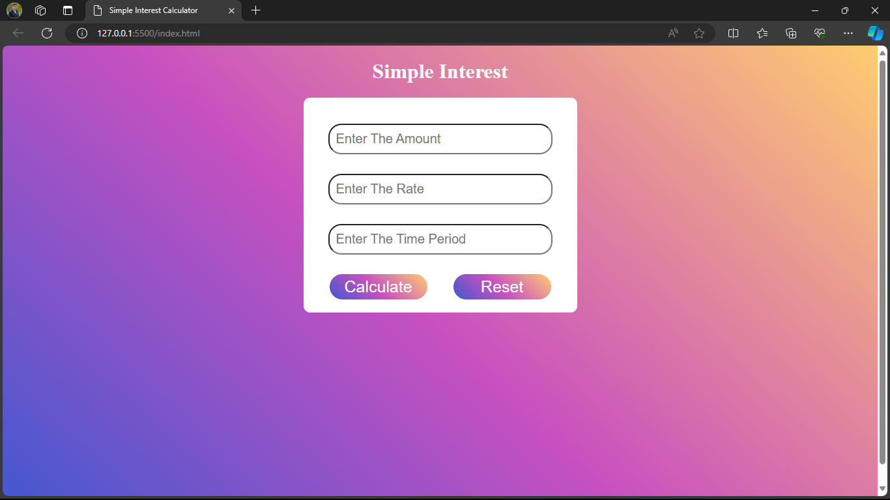

# Simple Interest Calculator

This is a Simple Interest Calculator. 
Developed using HTML , CSS and Javascript.
use for to calculate Simple Interest.

## Description

The Simple Interest Calculator is designed to calculate Simple Interest.

## Installation

1. Clone the repository: git clone https://github.com/Prajyot5015/simple-interest-calculator
2. Open the project directory.
3. Run index.html in a web browser.
